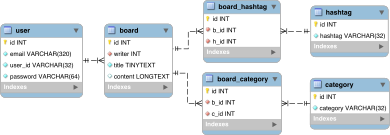

# BCSD-Assignment-BackEnd
BCSD BackEnd 실습 과제 - 5주차

## 커뮤니티 DB 설계
- 커뮤니티를 만든다고 가정했을 때, 필요한 테이블과 각각 관계 생성 (아래 테이블은 필수)
- 해시태그 테이블에는 해시태그의 정보만 담겨있다.
- 하나의 게시글은 여러개의 해시태그를 포함할 수 있다.
  - user(유저)
  - board(게시글)
  - category(카테고리)
  - hashtag(해시태그)

## Diagram
